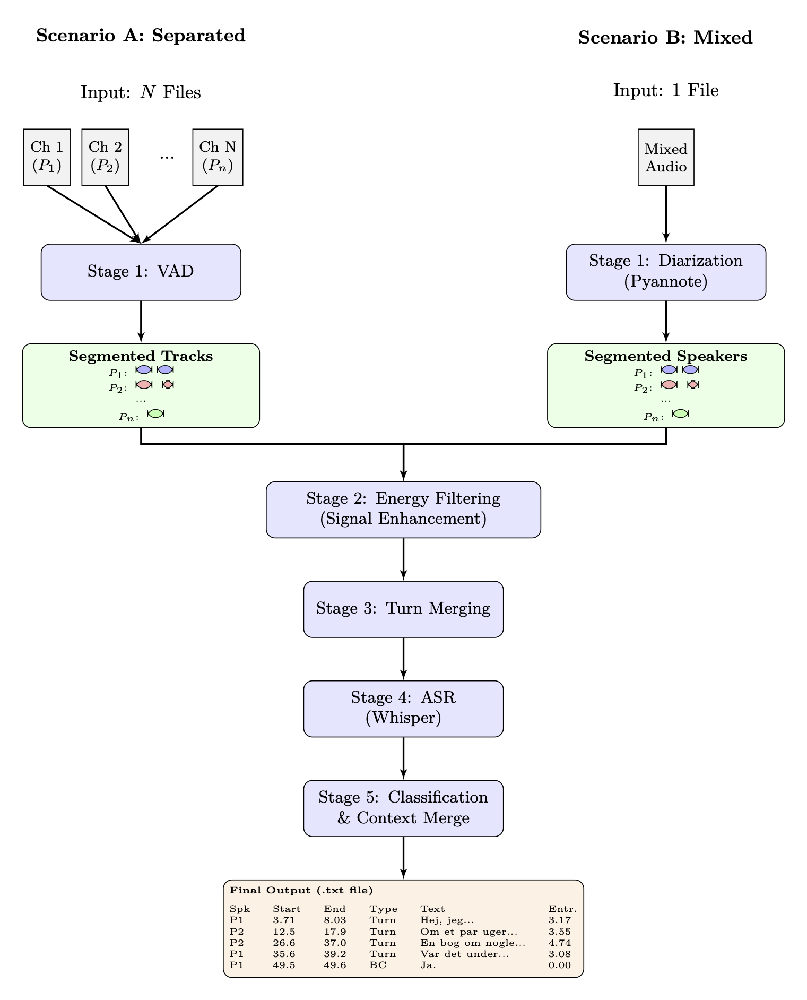
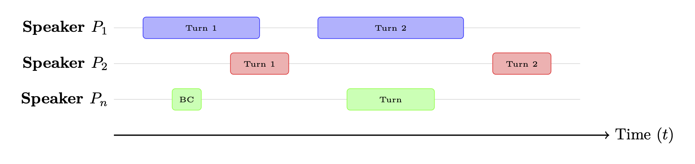

# Speech VAD, Diarization & Transcription Pipeline

End-to-end processing of conversation recordings with support for both pre-separated and mixed audio. Produces cleaned, transcribed, and labeled segments; labels can optionally be exported to the user's annotation software of choice (e.g., ELAN) for manual review.


*Pipeline architecture: splits at Stage 1 (VAD vs Diarization) based on input type, then converges for unified processing.*

## Features

- **Multiple VAD methods**: rVAD, silero (mult channel) or Pyannote.audio (single chanel)
- **Diarization**: Pyannote.audio for single-channel recordings
- **Transcription**: Whisper with GPU acceleration and batching
- **Smart processing**: Turn merging, entropy-based labeling, context-aware annotation

---

## Installation

FFmpeg is required for audio processing. Choose one of the following installation options depending on your environment.

### Option 1: Pure UV (Recommended)

Use this if you have admin access to install system packages.

```bash
# Install FFmpeg
sudo apt update && sudo apt install -y ffmpeg  # Ubuntu/Debian
# brew install ffmpeg                          # macOS

# Install UV
curl -LsSf https://astral.sh/uv/install.sh | sh

# Clone and set up
git clone https://github.com/haraldsr/Speech_VAD_Diarization_Transcription.git
cd Speech_VAD_Diarization_Transcription

uv venv --python 3.10
source .venv/bin/activate  # Windows: .venv\Scripts\activate
uv pip install -r requirements-lock-uv.txt
pip install -e .
```

### Option 2: Hybrid Conda + UV (No Admin Access)

Use this on HPC clusters or systems where you cannot install FFmpeg at the system level. Requires Conda/Mamba to be pre-installed.

```bash
# Install UV
curl -LsSf https://astral.sh/uv/install.sh | sh

# Clone and set up
git clone https://github.com/haraldsr/Speech_VAD_Diarization_Transcription.git
cd Speech_VAD_Diarization_Transcription

# Create Conda environment (provides FFmpeg)
conda env create -f environment-minimal.yml -n vdt  # or use mamba
conda activate vdt

# Install Python packages with UV
uv pip install -r requirements-lock-uv.txt
pip install -e .
```

**Note:** Mixing Conda and UV is not ideal, but necessary when system package installation is unavailable.

### Make Shortcuts

**For users (recommended):**

```bash
make install         # Auto-detects GPU/CPU and installs from lockfile
make install-dev     # Install from requirements.txt (for development/testing)
make install-conda   # Full Conda install (slower, no UV)
```

The `make install` auto-detects GPU using `nvidia-smi`:
- **GPU detected** → uses `requirements-lock-uv-gpu.txt`
- **No GPU** → uses `requirements-lock-uv-cpu.txt`

**For maintainers (creating lockfiles):**

```bash
# In GPU environment (auto-creates requirements-lock-uv-gpu.txt):
make gen-lock

# In CPU environment (auto-creates requirements-lock-uv-cpu.txt):
make gen-lock
```

The `gen-lock` command automatically detects GPU and names the file accordingly.

---

## Quick Start

See `conversation_pipeline.py` for complete examples with different configurations.

### Pre-separated Audio (Dyad/Triad)

```python
from speech_vad_diarization_transcription import process_conversation

# Dyad example (two speakers, separate audio files)
results = process_conversation(
    speakers_audio={
        "P1": "path/to/speaker1.wav",
        "P2": "path/to/speaker2.wav",
    },
    output_dir="outputs/dyad",
    vad_type="silero",  # or "rvad"
)

# Triad example (three speakers)
results = process_conversation(
    speakers_audio={
        "P1": "path/to/speaker1.wav",
        "P2": "path/to/speaker2.wav",
        "P3": "path/to/speaker3.wav",
    },
    output_dir="outputs/triad",
    vad_type="rvad",
)
```

### Single Mixed Audio (Diarization)

Requires a HuggingFace token with access to pyannote models. Set via:
- Environment variable: `export HF_TOKEN="your-token"`
- Or login: `huggingface-cli login`

```python
# Single file with multiple speakers - uses pyannote diarization
results = process_conversation(
    speakers_audio="path/to/mixed_audio.wav",
    output_dir="outputs/diarized",
    vad_type="pyannote",  # Required for diarization
    auth_token=os.environ.get("HF_TOKEN"),  # Or None if logged in via CLI
)
```

### Speaker Separation + Pipeline

For mixed audio with overlapping speakers, first separate with SepFormer:

```python
# See run_separation_and_pipeline.py for complete example
from speech_separation_chunked import separator, separate_audio_with_smart_chunking
model = separator.from_hparams(source="speechbrain/sepformer-wsj02mix")
separated = separate_audio_with_smart_chunking(model, "mixed.wav")
# Then use process_conversation() with separated audio paths
```

---

## Key Parameters

| Parameter | Default | Description |
|-----------|---------|-------------|
| `vad_type` | `"rvad"` | VAD method: `"rvad"`, `"silero"`, or `"pyannote"` |
| `vad_min_duration` | `0.07` | Minimum segment duration (seconds) |
| `energy_margin_db` | `10.0` | Energy threshold for filtering |
| `gap_thresh` | `0.5` | Max gap for merging segments |
| `transciption_model_name` | `"openai/whisper-large-v3"` | Whisper model (or custom like `"CoRal-project/roest-whisper-large-v1"`) |
| `whisper_language` | `"da"` | Target language code |
| `whisper_device` | `"auto"` | `"auto"`, `"cuda"`, or `"cpu"` |
| `batch_size` | `30.0` | Batch size in seconds |
| `export_elan` | `True` | Export tab-delimited file for annotation software |

---

## Output Files


*Each speaker track consists of discrete, timestamped speech intervals (Turns or Backchannels).*

```
outputs/
└── experiment_name/
    ├── P1/                            # Speaker-specific folder
    │   └── speaker1_vad.txt           # VAD timestamps
    ├── P2/
    │   └── speaker2_vad.txt
    ├── merged_turns.txt               # Merged conversation turns
    ├── raw_transcriptions.txt         # Raw Whisper output
    ├── classified_transcriptions.txt  # With entropy labels
    ├── final_labels.txt               # Context-merged annotations (TSV)
    └── final_labels_elan.txt          # ELAN-compatible format
```

**Pipeline output format (`final_labels.txt`):**
```
speaker	start_sec	end_sec	transcription	entropy	type
P1	0.50	2.30	Hello there	2.31	turn
P2	2.45	3.10	Mm-hmm	0.00	backchannel
```

**ELAN import format (`final_labels_elan.txt`):**
```
tier	begin	end	annotation
P1_turn	500	2300	Hello there
P2_backchannel	2450	3100	Mm-hmm
```

To import in ELAN: **File → Import → Tab-delimited Text...** (skip first line: Yes)
---

## Carbon Tracking

The pipeline optionally integrates [CarbonTracker](https://github.com/lfwa/carbontracker) for monitoring energy consumption and CO₂ emissions during processing.

To enable carbon tracking in `conversation_pipeline.py`:

```python
ENABLE_CARBON_TRACKING = True  # Set in conversation_pipeline.py
```

Optionally set an [Electricity Maps](https://www.electricitymaps.com/) API key for accurate CO₂ intensity data:

```bash
export ELECTRICITYMAPS_API_KEY="your-api-key"
```

Logs are saved to `logs/carbon/`. See `conversation_pipeline.py` for configuration options including CPU TDP simulation for systems without direct power measurement.

---

## Troubleshooting

### FFmpeg Not Found / Torchcodec Error
```bash
# The error "Could not load libtorchcodec" means FFmpeg is missing
# Install FFmpeg at system level:

# Ubuntu/Debian:
sudo apt update && sudo apt install -y ffmpeg

# macOS:
brew install ffmpeg

# Verify installation:
ffmpeg -version

# Then reinstall torchcodec:
pip install --force-reinstall torchcodec==0.8.1
```

**Note:** Conda environments include FFmpeg automatically. UV/pip environments require manual FFmpeg installation.

### FFmpeg Version Mismatch

If you see errors about missing symbols or incompatible FFmpeg libraries:

```bash
# Check FFmpeg version (requires 6.x or 7.x for torchcodec)
ffmpeg -version

# Ubuntu 22.04 has FFmpeg 4.x by default - use Conda or upgrade:
conda install -c conda-forge ffmpeg=7.*

# Or reinstall torchcodec to match your FFmpeg version:
pip install --force-reinstall torchcodec
```

### Out of Memory
```python
# Reduce batch sizes
batch_size=15.0, # sec
```

### GPU Not Detected
```python
# Check PyTorch CUDA
import torch
print(torch.cuda.is_available())

# Force CPU if needed
whisper_device="cpu"
```

### Package Version Conflicts
```bash
# Use UV for better dependency resolution
uv pip install -r requirements-lock-uv.txt --upgrade
```

---

## Repository Structure

```
.
├── Makefile                      # Build automation (install, lint, clean)
├── README.md
├── LICENSE
├── pyproject.toml                # Package metadata and tool configuration
├── setup.py                      # Package installation
├── environment-minimal.yml       # Minimal Conda env (Python + FFmpeg only)
├── environment.yml               # Full Conda environment
├── requirements.txt              # Flexible dependencies (development)
├── requirements-lock-uv.txt      # Exact dependencies (reproducibility)
├── .env.example                  # Example environment variables (HF_TOKEN, etc.)
├── .flake8                       # Linting configuration
├── conversation_pipeline.py      # Example usage with dyad/triad/diarization configs
├── docs/
│   └── figures/                  # Pipeline diagrams
├── scripts/
│   └── generate_uv_lock.sh       # Script to regenerate lockfile
└── src/                          # Package source (installed as speech_vad_diarization_transcription)
    ├── __init__.py               # Exports process_conversation, load_whisper_model, etc.
    ├── conversation.py           # Main API: process_conversation()
    ├── vad.py                    # VAD wrappers (rVAD, Silero, Pyannote)
    ├── postprocess_vad.py        # Energy filtering, segment cleaning
    ├── merge_turns.py            # Turn merging logic
    ├── transcription.py          # Whisper transcription
    └── labeling.py               # Entropy-based labeling
```

---

## Development

### Make Commands

```bash
make help          # Show all available commands
make install       # Install with hybrid approach (recommended)
make install-uv    # Install with UV only (requires system FFmpeg)
make install-conda # Install with Conda/Mamba
make lint          # Run linting (flake8, mypy, isort, black)
make format        # Format code (isort + black)
make clean         # Remove build artifacts
```

### View Installed Packages
```bash
pip list
conda list  # If using conda
```

### Update Environment to Match Working Setup
```bash
# Using UV (recommended)
conda activate vdt
pip list --format=freeze | sed 's/grpcio==1.74.1/grpcio>=1.74.0/; s/matplotlib==3.10.8/matplotlib>=3.10.0/' > requirements-lock-uv.txt

# Then apply to another environment
conda activate other_env
uv pip install -r requirements-lock-uv.txt --upgrade
```

---

## Files

- **`environment-minimal.yml`**: Minimal Conda environment (Python 3.10 + FFmpeg only)
- **`environment.yml`**: Full Conda environment (all dependencies from Conda)
- **`requirements.txt`**: Flexible versions (`>=`) for development
- **`requirements-lock-uv.txt`**: Exact versions for reproducibility (UV-compatible)

**Recommended workflow:** Use `environment-minimal.yml` + `requirements-lock-uv.txt` for best performance.

---

## Credits

- **Pyannote.audio**: https://github.com/pyannote/pyannote-audio
- **SpeechBrain**: https://speechbrain.github.io/
- **Whisper**: https://github.com/openai/whisper
- **rVAD**: https://github.com/zhenghuatan/rVADfast
- **UV**: https://github.com/astral-sh/uv
- **CarbonTracker**: https://github.com/lfwa/carbontracker

---

## License

**TODO: Temporary** - All Rights Reserved - Copyright (c) 2025 Harald Skat-Rørdam, Hanlu He

No license is currently granted for use, modification, or distribution of this software. An open-source license will be applied once determined by the copyright holders. See [LICENSE](LICENSE) file for details.
